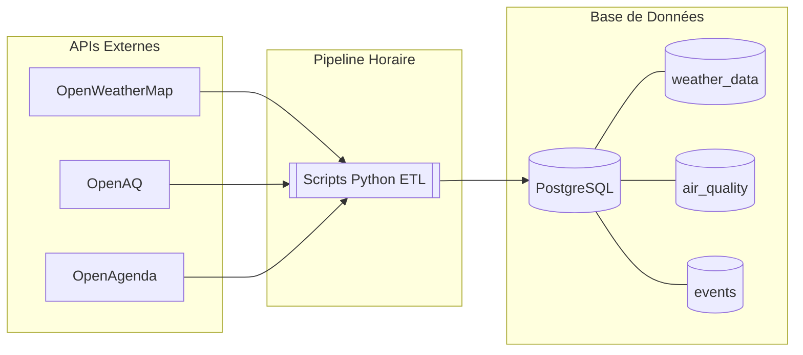
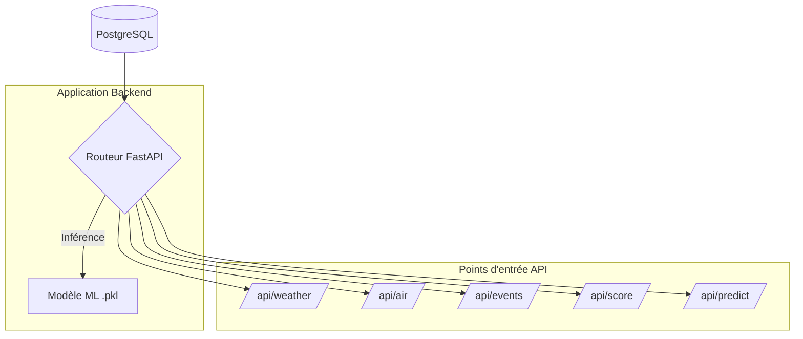
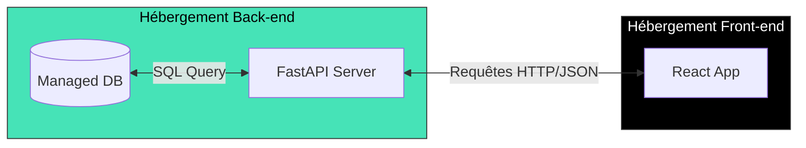

# 🏙️ CityPulse — PulseBoard MVP

> Tableau de bord urbain intelligent (météo, air, événements, score urbain, prédiction ML) avec backend FastAPI, frontend React/Vite, et application Android via Capacitor.


---

## Fonctionnalités

Le projet expose actuellement les fonctionnalités suivantes:

- Sélection de ville (Paris, Lyon, Marseille, Lille, Bordeaux par défaut dans le pipeline).
- Météo actuelle.
- Prévisions météo (24h, pas de 3h).
- Qualité de l'air (AQI + polluants).
- Événements a venir (jusqu'a 5 elements dédoublonnes).
- Score urbain calcule a partir météo/air/événements.
- Prédiction de temperature sur les prochaines heures via modèles ML.
- Carte interactive côte frontend.

## Stack technique

### Backend

- [FastAPI](https://fastapi.tiangolo.com/) — API REST haute performance
- [PostgreSQL](https://www.postgresql.org/) + [SQLAlchemy](https://www.sqlalchemy.org/) — Base de données et ORM
- Pipelines — Collectes, normalisation et chargement en base

### Frontend
- [React 18](https://react.dev/) — Bibliothèque d'interface utilisateur
- [TailwindCSS](https://tailwindcss.com/) — Styles utilitaires
- [Recharts](https://recharts.org/) — Graphiques interactifs
- [Leaflet](https://leafletjs.com/) — Carte interactive

### Data & Machine Learning
- [Pandas](https://pandas.pydata.org/) / [NumPy](https://numpy.org/) — Manipulation de données
- [Scikit-learn](https://scikit-learn.org/) — Modèles ML (Régression Linéaire, Random Forest)
- [Jupyter](https://jupyter.org/) — Notebooks d'analyse exploratoire

### DevOps
- [Git](https://git-scm.com/) / [GitHub](https://github.com/) — Versioning
- [Render](https://render.com/) — Hébergement du backend
- [Vercel](https://vercel.com/) — Hébergement du frontend
- [Docker](https://www.docker.com/) — Conteneur PostgreSQL en local

---

## 🏛️ Architecture

## 1. Flux d'Ingestion des Données (Pipeline ETL)

Ce diagramme se concentre sur la récupération et le stockage des données brutes.



## 2. Architecture de l'API (Back-end & ML)

Ici, on détaille comment le serveur FastAPI expose les données et utilise le modèle de Machine Learning.



## 3. Architecture de Déploiement (Infrastructure)

Ce schéma montre la séparation "Cloud" entre le front et le back.




## Architecture modulaire du projet

- **Data Engineering** (`data/`) — Scripts Python qui collectent, nettoient et stockent les données en base toutes les heures.
- **Machine Learning** (`ml/`) — Notebooks Jupyter pour l'exploration, l'entraînement et l'export des modèles en `.pkl`.
- **Backend** (`back/`) — FastAPI expose les endpoints, charge les modèles ML et interroge PostgreSQL via SQLAlchemy.
- **Frontend** (`front/`) — Application React qui consomme l'API et affiche le tableau de bord.
- **Android** (`front/android`) — Application Android qui consomme l'API et affiche le tableau de bord sur un appareil mobile.

---

## 📁 Structure du projet

```text
citypulse-pulseboard/
|- back/
|  |- main.py
|  |- database.py
|  |- models.py
|  |- schemas.py
|  |- routers/
|  |  |- weather.py
|  |  |- air.py
|  |  |- events.py
|  |  |- score.py
|  |  \- predict.py
|  |- services/
|  |- pipelines/
|  \- requirements.txt
|- front/
|  |- src/
|  |- public/
|  |- android/
|  \- package.json
|- data/
|  |- schema.sql
|  |- init.py
|  \- TABLES_PIPELINE_DOCUMENTATION.md
|- ml/
|  |- modele_lille_linear.pkl
|  |- modele_lille_rf.pkl
|  |- model_final.pkl
|  |- urban_analysis.ipynb
|  |- lille_analysis.ipynb
|- docker-compose.yml
|- .env.example
\- README.md
```

## Démarrage rapide

### Prérequis

- Python 3.11+
- Node.js 18+
- npm
- Docker (optionnel)

### 1) Cloner le depot

```bash
git clone https://github.com/cedric-mc/citypulse-pulseboard.git
cd citypulse-pulseboard
```

### 2) Variables d'environnement

#### Backend

Le backend lit les variables depuis un fichier `.env` (habituellement dans `back/`).

A partir du fichier exemple racine:

```bash
cp .env.example back/.env
```

Variables attendues:

- `OPENWEATHER_API_KEY`
- `OPENAGENDA_API_KEY`
- `OPEN_AQ_API_KEY` (present dans le template, non bloquant)
- `DATABASE_URL` (utile pour PostgreSQL / scripts d'init)

#### Frontend

```bash
cp front/.env.example front/.env
```

Variables frontend:

- `VITE_API_BASE` (ex: `http://127.0.0.1:8000`)
- `VITE_ML_API_BASE` (ex: `http://127.0.0.1:8000`)

### 3) Installer les dépendances

#### Backend

```bash
cd back
python -m venv .venv
source .venv/bin/activate  # Windows: .venv\Scripts\activate
pip install -r requirements.txt
cd ..
```

#### Frontend

```bash
cd front
npm install
cd ..
```

### 4) Lancer l'application

#### Backend (API)

```bash
cd back
uvicorn main:app --reload
```

- API: http://127.0.0.1:8000
- Swagger: http://127.0.0.1:8000/docs

#### Frontend (Vite)

```bash
cd front
npm run dev
```

- Front: http://127.0.0.1:5173

## Base de donnees

### Mode local actuel

Le code backend est configure en mode développement local sur SQLite (`citypulse.db`).

### PostgreSQL (optionnel)

- Un service PostgreSQL local est fourni via `docker-compose.yml`.
- Le script `data/init.py` initialise le schema SQL a partir de `data/schema.sql` et nécessite `DATABASE_URL`.

Lancement PostgreSQL:

```bash
docker-compose up -d
```

Initialisation schema:

```bash
python data/init.py
```

## Pipelines de donnees

Les scripts sont dans `back/pipelines`.

Execution ponctuelle (collecte villes par défaut):

```bash
cd back
python -m pipelines.collect_public_data
```

Execution horaire (un cycle):

```bash
cd back
python -m pipelines.hourly_ingest --once
```

Execution horaire continue:

```bash
cd back
python -m pipelines.hourly_ingest
```

Simulation de donnees:

```bash
cd back
python -m pipelines.simulate_48h --hours 48
```

## API (resume)

Préfixe commun: `/api`

- `GET /` - Healthcheck
- `GET /api/weather/{city}` - Météo actuelle
- `GET /api/forecast/{city}` - Prévisions 24h
- `GET /api/air/{city}` - Qualité de l'air
- `GET /api/events/{city}` - Événements
- `GET /api/score/{city}` - Score urbain
- `GET /api/predict/{city}?hours=6` - Prediction temperature (max 6)

Documentation complete: voir `back/API_DOCUMENTATION.md`.

## Tests

Frontend:

```bash
cd front
npm test
```

Lint frontend:

```bash
cd front
npm run lint
```

## Déploiement

- Backend: Render
- Frontend: Vercel

Pensez a renseigner les variables d'environnement sur chaque plateforme (`OPENWEATHER_API_KEY`, `OPENAGENDA_API_KEY`, `DATABASE_URL`, `VITE_API_BASE`, `VITE_ML_API_BASE`).

## Équipe

Projet interdisciplinaire 2025-2026 (B2 DSF, B3 DSF, M1 LDF, M1 DAN, M1 DAT) :
- ABALLO – Lecoeur Ramadan Koffi – B2
- DELALE – Dorian – B3
- MARIYA CONSTANTINE – Cédric – M1 LDF
- MORAWSKI – Hubert – B2
- OULDKACI- Amine - M1 DAN
- YIMA – Josué – B3

## Licence

Projet réalisé a des fins pédagogiques.
Tous droits réservés.
